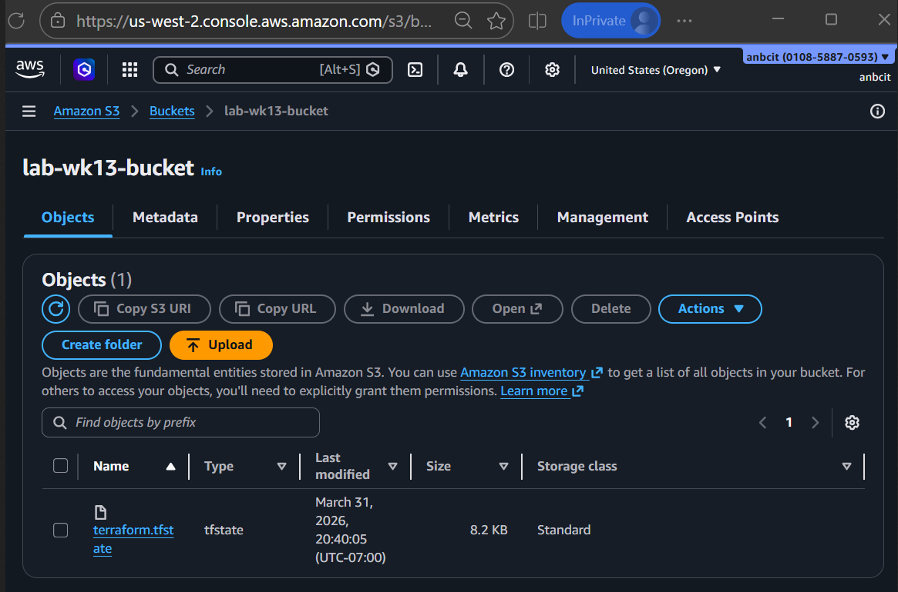
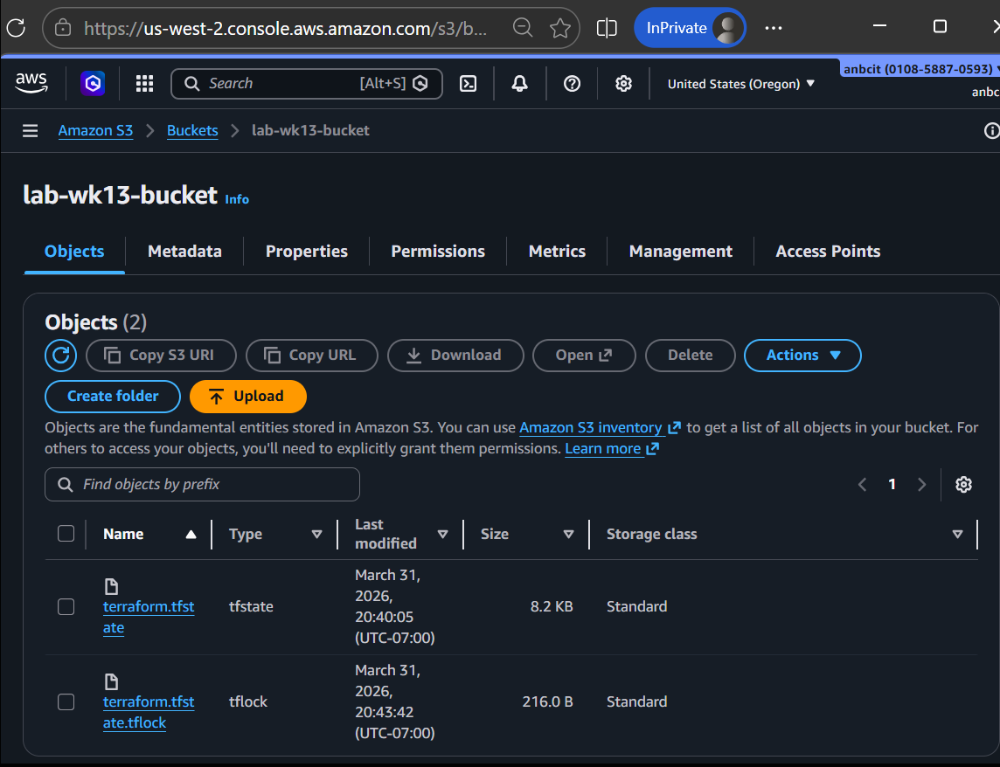

# Terraform S3 Bucket Lab
### Maksym Buhai, Jasmeen Sandhu, Augustin Nguyen

1. Create an S3 bucket
    
    ```bash
    sudo chmod +x create-bucket
    ./create-bucket lab-wk13-bucket
    ```
    
2. Edit the terraform [provider.tf](http://provider.tf) file to include the backend  configuration inside the terraform block
    
    ```bash
    terraform {
      backend "s3" {
        bucket       = "lab-wk13-bucket"
        key          = "terraform.tfstate"
        region       = "us-west-2"
        encrypt      = true
        use_lockfile = true
      }
    ```
    
3. Test the remote backend, check for the S3 bucket
4. Run terraform commands
    
    ```bash
    terraform init
    terraform fmt
    terraform plan
    terraform apply
    ```
    
5. Screenshots of state and lock file
   
   
7. Cleanup

## Questions 
- When is the state file created?
    
    The state file is created after terraform apply is run successfully.
    
- When is the lock file present?
    
    The lock file is present when a terraform command such as terraform plan or apply are in the process of running.
    
- Is the lock file always in the bucket after it is created?
    
    No, the lock file is not always in the bucket after it is created. Terraform automatically removes the lock file when the terraform command finishes.
